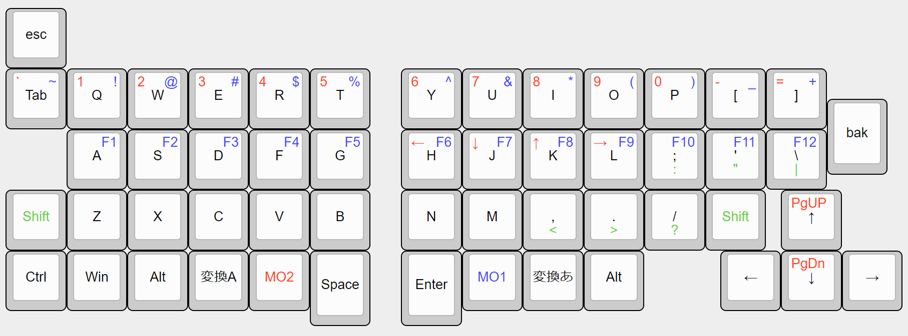

# my-rust-keyboard
To make it easier to get into the swamp of homemade keyboards, I'll make a keyboard that doesn't have a very different layout. I'll also do a left/right split.

## Keyboard layout design image

上を作りたいけど、基板発注とかもやったことないので、名刺サイズから作成してみる。
## loadmap
ざっくり
- [ ] キーボードの部品選定
  - [x] キースイッチ
    - Kailhロープロファイルスイッチ
  - [x] キーキャップ
    - Kailhロープロファイルスイッチキャップ
  - [x] pico or esp32
    - ESP32C3
  - [ ] socket
  - [ ] ダイオード
  - [ ] LED
  - [ ] アクリルプレート
- [ ] CAD：PCBデザイン
  - [ ] デザイン
  - [ ] 基板発注
- [ ] ファームウェア開発
  - [ ] Rust環境作成
  - [ ] ファームウェア作成
- [ ] Reキーマップ用ソフトウェアの作成
  - [ ] 構成の決定
  - [ ] 設計
  - [ ] 実装
- [ ] ドキュメント作成
  - [ ] 組み立て手順
  - [ ] ファームウェア設定手順（もしくは実装説明）
  - [ ] Reキーマップの説明